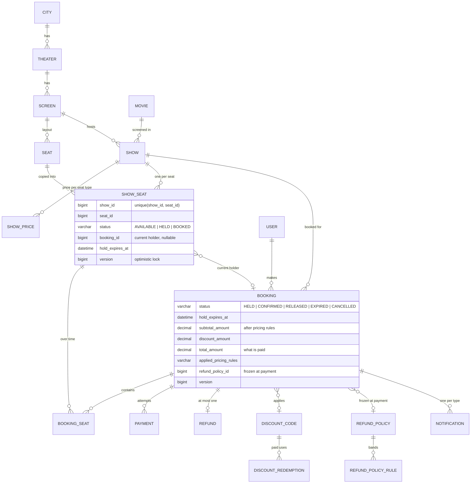
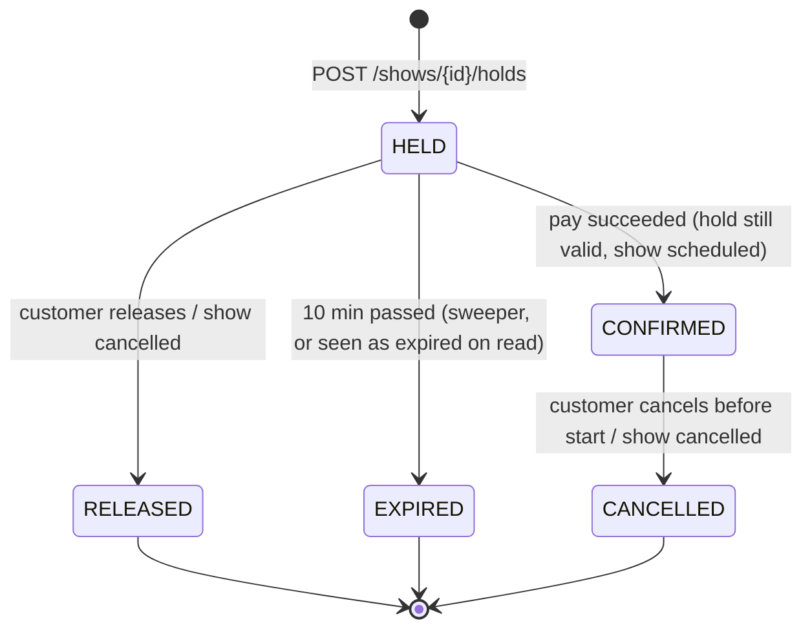
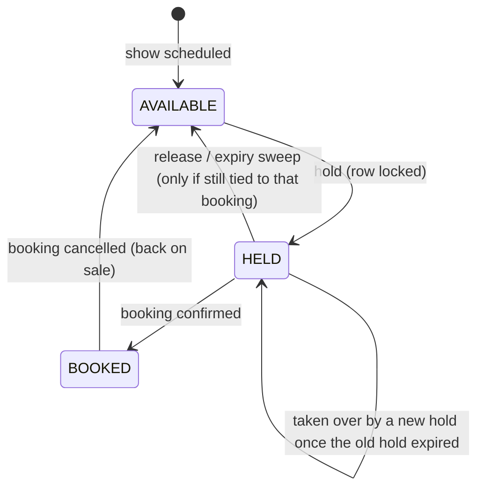
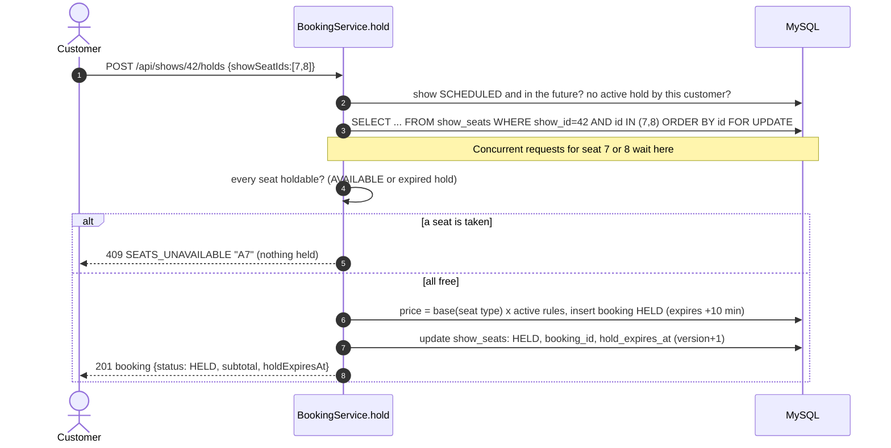
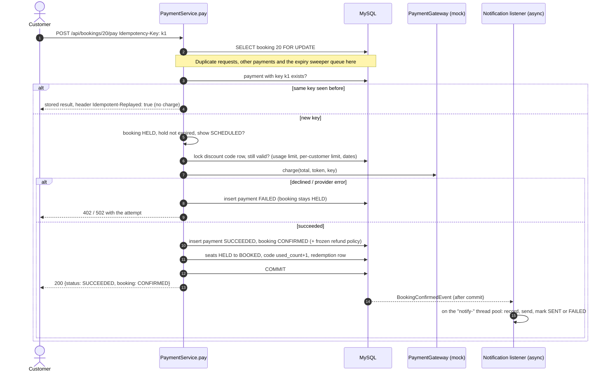
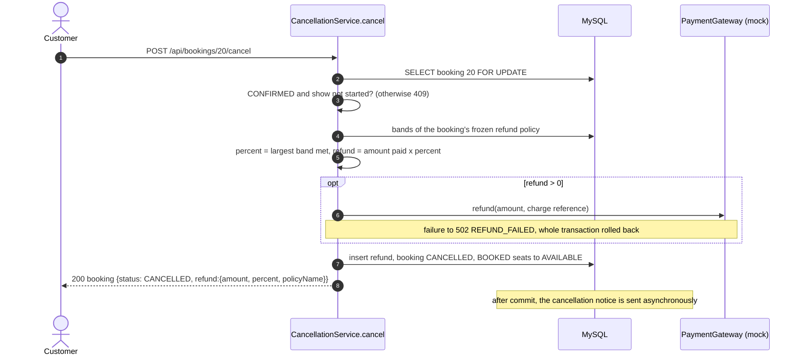
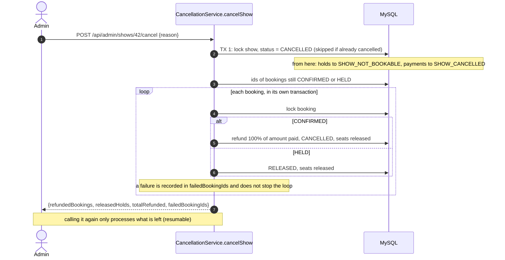

# Design

This document explains how the system works and why. For setup and the summary of decisions see the
[README](../README.md); for a runnable walkthrough see [HAPPY_FLOW.md](HAPPY_FLOW.md).

1. [Data model](#data-model)
2. [State machines](#state-machines)
3. [Main flows](#main-flows)
4. [Concurrency: every race and how it is handled](#concurrency-every-race-and-how-it-is-handled)
5. [Transactions and background work](#transactions-and-background-work)
6. [Pricing, discount and refund arithmetic](#pricing-discount-and-refund-arithmetic)
7. [Security model](#security-model)
8. [Error catalogue](#error-catalogue)
9. [Alternatives considered](#alternatives-considered)

---

## Data model

There are 19 tables, created by Flyway migrations V1–V10 (`src/main/resources/db/migration`). Every table has
`id`, `created_at` and `updated_at`.



| Table | Purpose | Key constraints |
|---|---|---|
| `users` | Customers and admins (`role`) | unique `email` (stored lower case) |
| `cities`, `theaters`, `screens` | Catalogue hierarchy | unique name per parent |
| `seats` | **Physical** layout of a screen | unique `(screen_id, row_label, seat_number)` |
| `movies` | Titles | unique `(title, language)` |
| `shows` | A movie on a screen at a time; `end_time` includes the cleaning gap | index `(screen_id, start_time)` |
| `show_prices` | Base price per seat type per show | unique `(show_id, seat_type)` |
| `show_seats` | **The bookable unit**: one row per physical seat per show | unique `(show_id, seat_id)`, `@Version` |
| `bookings` | A hold that becomes an order; price breakdown; frozen refund policy | `@Version`; indexes for expiry and history |
| `booking_seats` | Seats of a booking with the base and charged price at hold time | unique `(booking_id, show_seat_id)` |
| `pricing_rules` | `WEEKEND` / `PRIME_TIME` percentages | unique `name` |
| `discount_codes`, `discount_redemptions` | Codes with limits; one redemption row per paid booking | unique `code`; unique `booking_id` on redemptions |
| `payments` | Every attempt (success or failure) | unique `idempotency_key` |
| `refund_policies`, `refund_policy_rules`, `refunds` | Time-band policies; one refund per booking | unique `(policy_id, min_hours)`; unique `booking_id` on refunds |
| `notifications` | Recorded before sending; status, attempts, error | unique `(booking_id, type)` |

**Why `show_seats` exists.** Availability is a property of a seat *in a show*, not of the physical seat. Copying the
layout into `show_seats` when a show is scheduled gives a row that can be locked, versioned and uniquely constrained
per show. It also means changing a layout can never affect shows that already exist, which is why a layout is frozen
once shows exist.

**Why `booking_seats` stores prices.** Prices are decided when seats are held (base price × pricing rules) and never
recalculated, so later changes to prices or rules cannot change what a customer owes or is refunded.

---

## State machines

### Booking



- Every move out of `HELD` is **conditional** (`… WHERE status = 'HELD'`) or happens under the **booking row lock**,
  so two transitions can never both win (e.g. paying and expiring at the same instant).
- An overdue `HELD` booking is **reported as `EXPIRED` immediately**, in booking responses, history and status
  filters, before the sweeper has updated the row.

### Show seat



A seat is **holdable** when it is `AVAILABLE`, **or** `HELD` with `hold_expires_at <= now` (`ShowSeat.isHoldable`).
The same rule drives the seat map, the availability counts and the sales report.

---

## Main flows

### Hold seats: lock, then check



The locks are taken in **id order**, so request A `[7, 8]` and request B `[8, 7]` both lock 7 first. One waits
instead of each holding one lock and waiting for the other (a deadlock).

### Pay and confirm



### Cancel with refund



### Admin cancels a show



---

## Concurrency: every race and how it is handled

| Race | Mechanism | Verified by |
|---|---|---|
| Many customers hold the **same seat** at once | Row lock on `show_seats` before checking; all or nothing | `twentyCustomersRaceForOneSeat_exactlyOneWins` (H2 + MySQL) |
| Overlapping **multi-seat** holds (`[A1,A2]` vs `[A2,A1]`) | Locks taken **in id order**, so no deadlock | `overlappingMultiSeatHolds_neverDoubleAllocate_andDoNotDeadlock` (H2 + MySQL) |
| A new hold on a seat whose **hold just expired**, before the sweeper runs | Expired seat counts as holdable; the sweeper frees only seats **still tied to the old booking** | `takeoverOfExpiredSeat_isNotUndoneWhenSweeperExpiresTheOldBooking` |
| **Payment vs. expiry** at the same instant | Booking row lock + conditional `expireIfDue … WHERE status = HELD`; exactly one wins | Lock semantics; `confirmedBooking_isNotTouchedByTheExpirySweeper` |
| **Double-click pay** (different keys) | Booking row lock; the second sees `CONFIRMED` → 409 | `concurrentPaymentsForOneBooking_chargeExactlyOnce` (H2 + MySQL) |
| **Retry with the same key** while the first is running | Booking row lock, then lookup by key → replay; unique key constraint as a backup | `sameIdempotencyKeySentConcurrently_chargesOnce_andEveryoneGetsThatPayment` (H2 + MySQL) |
| Two customers take the **last use of a discount code** | Code row locked and re-validated at payment; `used_count` incremented under the lock | `lastUseOfADiscountCode_goesToExactlyOneOfTwoConcurrentPayments` (H2 + MySQL) |
| Customer taps **cancel** several times | Booking row lock; the second sees `CANCELLED` → 409; unique `refunds.booking_id` | `concurrentCancellationsOfOneBooking_refundExactlyOnce` (H2 + MySQL) |
| Two admins schedule **overlapping shows** on a screen | Screen row locked before the overlap check | Lock semantics (`ScreenRepository.findByIdForUpdate`) |
| A **duplicate notification** (event redelivered, job re-run) | Unique `(booking_id, type)`; the second insert is ignored | `sameNotificationRequestedConcurrently_isRecordedAndSentOnce` |
| **Show cancellation vs. an in-flight payment** | Show marked CANCELLED first; payment checks the show status under the booking lock; the loop locks each booking | `heldBookingOfACancelledShow_cannotBePaid` |

**Why H2 and MySQL.** H2's locking is similar to InnoDB's but not identical. The scenarios live in
`BookingConcurrencyScenarios` and run twice: `BookingConcurrencyIT` (H2, always) and `BookingConcurrencyMySqlIT` (real
MySQL, when `MYSQL_IT_URL` is set). Both pass on MySQL 9.6.

---

## Transactions and background work

| Work | Transaction | Thread |
|---|---|---|
| Hold, release, apply/remove discount | One per request | Request thread |
| Pay + confirm | One per request; the (mock) gateway is called inside it, under the booking lock | Request thread |
| Customer cancel | One per request, including the gateway refund | Request thread |
| Show cancel | One for the show + **one per booking** | Request thread |
| Expire holds | **One per booking** (`HoldExpiryJob`, every 30s) | Scheduler |
| Notifications | (1) record PENDING, (2) send **outside any transaction**, (3) mark SENT/FAILED | `notify-` pool, after commit |
| Reminders / retries | `NotificationJobs` (every 5 min / 60s), per notification as above | Scheduler |

- **After-commit events.** `BookingConfirmedEvent` and `BookingCancelledEvent` are handled by
  `@TransactionalEventListener(AFTER_COMMIT)` + `@Async`. Nothing is sent for a transaction that rolls back, and the
  customer's request never waits for the provider. Listeners catch every exception, because the booking is already
  committed.
- **Entity updates rather than bulk queries** for rows other code may already have loaded (confirming seats, activating
  a refund policy). Bulk queries bypass Hibernate's in-memory copies. Tests caught stale data twice, which is now a
  rule in [CLAUDE.md](../CLAUDE.md).
- **The clock is injected** (`Clock` bean). Tests replace it with `MutableClock` to move time forward.

---

## Pricing, discount and refund arithmetic

All money is `BigDecimal` with 2 decimals, rounded **HALF_UP**.

**Seat price** (`PricingService`)
```
price(seat) = base(show, seat type) × (100 + Σ matching active rule %) / 100      never below 0
WEEKEND    matches Saturday / Sunday of the show start (business time zone)
PRIME_TIME matches windowStart <= local start time < windowEnd
```
Example: base 350, Saturday 19:00, Weekend +20 and Prime time +10 → 350 × 1.30 = **455.00**.

**Discount** (`DiscountCalculator`), applied to the subtotal
```
PERCENT: min(subtotal × value / 100, maxDiscountAmount)       FLAT: value
discount = min(discount, subtotal)          total = subtotal − discount
```
Checked in this order, each with its own code: active → not before `validFrom` → before `validUntil` (exclusive) →
subtotal ≥ `minOrderAmount` → `usedCount < usageLimit` → customer's paid uses `< perUserLimit`.

**Refund** (`RefundCalculator`)
```
percent = band with the largest minHoursBeforeShow such that (showStart − now) >= minHours; otherwise 0
refund  = amountActuallyPaid × percent / 100            (100% when the show is cancelled)
```
With bands 48h → 100 and 24h → 50: 72h before → 100%; **exactly 48h → 100%**; 47h59m → 50%; 23h59m → 0%.
A policy must have unique thresholds, and **cancelling earlier must never refund less** (checked on create/update).

---

## Security model

| Route | Access |
|---|---|
| `POST /api/auth/register`, `POST /api/auth/login` | public |
| `GET /api/cities/**`, `/api/theaters/**`, `/api/movies/**`, `/api/shows/**` | public (browsing) |
| `/swagger-ui/**`, `/v3/api-docs/**` | public |
| `/api/admin/**` | role **ADMIN** |
| everything else | any valid token |

- **Tokens:** HS256 JWT, 24h, claims `sub` (user id), `email`, `role`, `iss`. The key comes from `app.jwt.secret`
  (min. 32 bytes), and the app **refuses to start** without it. Invalid, tampered, expired or claim-less tokens →
  `401 INVALID_TOKEN`.
- **Login** returns the same `401 INVALID_CREDENTIALS` for an unknown email and a wrong password, so accounts cannot
  be enumerated. Passwords are BCrypt-hashed.
- **Ownership:** the caller's id always comes from the token, never from the request body. Another customer's booking
  returns **404**, not 403, so booking ids cannot be probed. Admins can read any booking.
- **Secrets** live only in git-ignored files (`local.properties`, `http/http-client.private.env.json`) or environment
  variables. Test fixtures use obviously fake values.

---

## Error catalogue

All errors use one shape: `{timestamp, status, error, message, path, fieldErrors?}`.

| Status | Codes |
|---|---|
| 400 | `VALIDATION_FAILED` (with `fieldErrors`), `MALFORMED_REQUEST`, `INVALID_PARAMETER` (bad path/query/header, unknown sort field), `INVALID_LAYOUT`, `SHOW_IN_PAST`, `SCREEN_HAS_NO_SEATS`, `MISSING_PRICE`, `DUPLICATE_SEATS`, `TOO_MANY_SEATS`, `SEAT_NOT_IN_SHOW`, `INVALID_PRICING_RULE`, `INVALID_DISCOUNT`, `INVALID_REFUND_POLICY`, `INVALID_IDEMPOTENCY_KEY`, `DISCOUNT_NOT_FOUND`, `DISCOUNT_INACTIVE`, `DISCOUNT_NOT_YET_VALID`, `DISCOUNT_EXPIRED`, `DISCOUNT_MIN_ORDER_NOT_MET`, `DISCOUNT_EXHAUSTED`, `DISCOUNT_USER_LIMIT_REACHED` |
| 401 | `UNAUTHORIZED` (no token), `INVALID_TOKEN`, `INVALID_CREDENTIALS` |
| 402 | payment declined (body is the stored `PaymentResponse`, `failureCode` e.g. `CARD_DECLINED`, `INSUFFICIENT_FUNDS`) |
| 403 | `FORBIDDEN` |
| 404 | `NOT_FOUND` (unknown id, someone else's booking, unknown route) |
| 405 / 415 | `METHOD_NOT_ALLOWED`, `UNSUPPORTED_MEDIA_TYPE` |
| 409 | `EMAIL_ALREADY_REGISTERED`, `CITY_ALREADY_EXISTS`, `THEATER_ALREADY_EXISTS`, `SCREEN_ALREADY_EXISTS`, `MOVIE_ALREADY_EXISTS`, `PRICING_RULE_ALREADY_EXISTS`, `DISCOUNT_ALREADY_EXISTS`, `REFUND_POLICY_ALREADY_EXISTS`, `CITY_HAS_THEATERS`, `THEATER_HAS_SCREENS`, `SCREEN_HAS_SHOWS`, `MOVIE_HAS_SHOWS`, `SHOW_HAS_BOOKINGS`, `DISCOUNT_IN_USE`, `REFUND_POLICY_IN_USE`, `REFUND_POLICY_ACTIVE`, `SHOW_OVERLAP`, `SHOW_NOT_EDITABLE`, `SHOW_NOT_BOOKABLE`, `SHOW_CANCELLED`, `SHOW_ALREADY_ENDED`, `SEATS_UNAVAILABLE`, `ACTIVE_HOLD_EXISTS`, `BOOKING_NOT_HELD`, `HOLD_EXPIRED`, `BOOKING_ALREADY_CONFIRMED`, `BOOKING_NOT_CONFIRMED`, `BOOKING_ALREADY_CANCELLED`, `CANCELLATION_CLOSED`, `DISCOUNT_NO_LONGER_VALID`, `IDEMPOTENCY_KEY_REUSED`, `CONCURRENT_MODIFICATION`, `DATA_CONFLICT` |
| 500 | `INTERNAL_ERROR` (generic message; details only in the log) |
| 502 | `REFUND_FAILED`; payment provider error (stored `PaymentResponse`, `failureCode` `GATEWAY_ERROR`) |

---

## Alternatives considered

| Decision | Chosen | Alternative | Why |
|---|---|---|---|
| Seat concurrency | Pessimistic row lock, ordered | Optimistic `@Version` with retries; single conditional `UPDATE … WHERE status='AVAILABLE'` | Hot seats are always contended: a lock gives deterministic "first wins" without retry storms, and reads the rows needed for pricing anyway. `@Version` is kept as a backup |
| Hold storage | Rows in MySQL + sweeper + expiry on read | Redis keys with a TTL | One source of truth, transactional with the booking; no extra infrastructure (distributed systems were out of scope) |
| Hold expiry | Treat as free on read **and** sweep | Sweeper only | Correct even if the sweeper is late or down |
| Payment idempotency | Client key, stored per attempt, booking lock | Deduplicate by booking only | Distinguishes a network retry (same key → same answer) from a new attempt after a decline (new key) |
| Notifications | After-commit async events + recorded rows + retry job | Send inside the transaction; message broker | Never blocks or rolls back a booking, never notifies for a rollback; a broker was out of scope (the `notifications` table works like an outbox) |
| Refund policy | Frozen on the booking at payment | Use the policy active at cancellation | Customers keep the terms they paid under |
| Schema | Flyway + validate | Hibernate `ddl-auto=update` | Reviewable, repeatable, identical on MySQL and H2 |
| Auth | JWT (Spring resource server) | HTTP Basic (used in the first iteration) | A real login step; the password is sent once |
