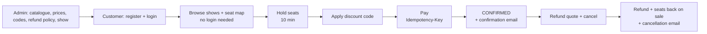

# Happy flow

The core flow end to end with `curl`: an admin sets up a cinema, a customer finds a show, holds seats, applies a
discount code, pays, and later cancels with a refund. The responses below are **real output** from a run of this
flow (trimmed for length). The same flow is scripted in [http/catalog.http](../http/catalog.http) and automated in
`CustomerJourneyIT`.

Prerequisites: the app is running on `http://localhost:8090` (see the [README](../README.md#running-it)) and you know
the bootstrap admin's email and password.

```bash
BASE=http://localhost:8090
```

Commands that store a value in a shell variable use this helper to read a JSON field:
```bash
json() { python3 -c "import sys,json; print(json.load(sys.stdin)$1)"; }
```



---

## 1. Admin: log in

```bash
ADMIN=$(curl -s -X POST $BASE/api/auth/login -H 'Content-Type: application/json' -d '{"email": "admin@moviebooking.local", "password": "<admin password>"}' | json "['accessToken']")
```
The response is `{"accessToken": "eyJ…", "tokenType": "Bearer", "expiresIn": 86400, "user": {"role": "ADMIN", …}}`.

## 2. Admin: city, theater, screen with seats, movie

```bash
CITY=$(curl -s -X POST $BASE/api/admin/cities -H "Authorization: Bearer $ADMIN" -H 'Content-Type: application/json' -d '{"name": "Pune", "state": "Maharashtra"}' | json "['id']")
```
```bash
THEATER=$(curl -s -X POST $BASE/api/admin/theaters -H "Authorization: Bearer $ADMIN" -H 'Content-Type: application/json' -d "{\"cityId\": $CITY, \"name\": \"Riverside Cinemas\", \"address\": \"Koregaon Park\"}" | json "['id']")
```
```bash
SCREEN=$(curl -s -X POST $BASE/api/admin/theaters/$THEATER/screens -H "Authorization: Bearer $ADMIN" -H 'Content-Type: application/json' -d '{"name": "Audi 1"}' | json "['id']")
```
The whole seat layout in one call: 8 regular rows × 12 + 2 premium rows × 10 = 116 seats.
```bash
curl -s -X PUT $BASE/api/admin/screens/$SCREEN/layout -H "Authorization: Bearer $ADMIN" -H 'Content-Type: application/json' -d '{"sections": [{"rows": "A-H", "seatsPerRow": 12, "seatType": "REGULAR"}, {"rows": "I-J", "seatsPerRow": 10, "seatType": "PREMIUM"}]}'
```
```json
{"screenId": 15, "screenName": "Audi 1", "totalSeats": 116, "seatsByType": {"REGULAR": 96, "PREMIUM": 20},
 "rows": [{"row": "A", "seatType": "REGULAR", "seats": [{"id": 1, "label": "A1", "number": 1}, …]}, …]}
```
```bash
MOVIE=$(curl -s -X POST $BASE/api/admin/movies -H "Authorization: Bearer $ADMIN" -H 'Content-Type: application/json' -d '{"title": "Oppenheimer", "language": "English", "genre": "Drama", "durationMinutes": 180, "certificate": "UA", "releaseDate": "2023-07-21"}' | json "['id']")
```

## 3. Admin: pricing rule, discount code, refund policy

```bash
curl -s -X POST $BASE/api/admin/pricing-rules -H "Authorization: Bearer $ADMIN" -H 'Content-Type: application/json' -d '{"name": "Prime time", "ruleType": "PRIME_TIME", "adjustmentPercent": 10, "windowStart": "18:00", "windowEnd": "22:00"}'
```
```bash
curl -s -X POST $BASE/api/admin/discount-codes -H "Authorization: Bearer $ADMIN" -H 'Content-Type: application/json' -d '{"code": "WELCOME10", "discountType": "PERCENT", "discountValue": 10, "maxDiscountAmount": 100, "perUserLimit": 1}'
```
```bash
curl -s -X POST $BASE/api/admin/refund-policies -H "Authorization: Bearer $ADMIN" -H 'Content-Type: application/json' -d '{"name": "Standard", "active": true, "rules": [{"minHoursBeforeShow": 48, "refundPercent": 100}, {"minHoursBeforeShow": 24, "refundPercent": 50}]}'
```

## 4. Admin: schedule a show

Use a future start time with an offset. At 18:30 the prime-time rule applies.
```bash
SHOW=$(curl -s -X POST $BASE/api/admin/shows -H "Authorization: Bearer $ADMIN" -H 'Content-Type: application/json' -d "{\"movieId\": $MOVIE, \"screenId\": $SCREEN, \"startTime\": \"2026-10-05T18:30:00+05:30\", \"prices\": {\"REGULAR\": 220, \"PREMIUM\": 380}}" | json "['id']")
```
```json
{"id": 15, "movie": {"title": "Oppenheimer", "durationMinutes": 180},
 "theater": {"name": "Riverside Cinemas", "cityName": "Pune"}, "screen": {"name": "Audi 1"},
 "startTime": "2026-10-05T18:30:00+05:30", "endTime": "2026-10-05T21:45:00+05:30",
 "status": "SCHEDULED", "prices": {"REGULAR": 220.00, "PREMIUM": 380.00},
 "effectivePrices": {"REGULAR": 242.00, "PREMIUM": 418.00}, "appliedPricingRules": ["Prime time"],
 "availableSeats": 116}
```
`endTime` = 18:30 + 180 min + 15 min cleaning. Another show on Audi 1 before 21:45 would be rejected with
`409 SHOW_OVERLAP`.

## 5. Customer: register and log in

```bash
curl -s -X POST $BASE/api/auth/register -H 'Content-Type: application/json' -d '{"name": "Demo Customer", "email": "customer@example.com", "password": "customer-demo-pass"}'
```
```bash
CUSTOMER=$(curl -s -X POST $BASE/api/auth/login -H 'Content-Type: application/json' -d '{"email": "customer@example.com", "password": "customer-demo-pass"}' | json "['accessToken']")
```
A customer calling an admin API is refused:
```bash
curl -s -X POST $BASE/api/admin/cities -H "Authorization: Bearer $CUSTOMER" -H 'Content-Type: application/json' -d '{"name": "Nagpur", "state": "MH"}'
```
```json
{"status": 403, "error": "FORBIDDEN", "message": "You do not have permission to perform this action", "path": "/api/admin/cities"}
```

## 6. Customer: browse (no token needed)

```bash
curl -s "$BASE/api/shows?cityId=$CITY&date=2026-10-05"
```
This returns a page of shows like the one in step 4, including `effectivePrices`.

Pick two seats from the seat map:
```bash
curl -s $BASE/api/shows/$SHOW/seats
```
```json
{"showId": 15, "startTime": "2026-10-05T18:30:00+05:30", "screenName": "Audi 1",
 "summary": {"AVAILABLE": 116, "HELD": 0, "BOOKED": 0}, "appliedPricingRules": ["Prime time"],
 "rows": [{"row": "A", "seatType": "REGULAR", "basePrice": 220.00, "price": 242.00,
           "seats": [{"showSeatId": 312, "label": "A1", "number": 1, "status": "AVAILABLE"},
                     {"showSeatId": 313, "label": "A2", "number": 2, "status": "AVAILABLE"}, …]}, …]}
```
```bash
SEAT1=$(curl -s $BASE/api/shows/$SHOW/seats | json "['rows'][0]['seats'][0]['showSeatId']"); SEAT2=$(curl -s $BASE/api/shows/$SHOW/seats | json "['rows'][0]['seats'][1]['showSeatId']")
```

## 7. Customer: hold the seats (10 minutes)

```bash
BOOKING=$(curl -s -X POST $BASE/api/shows/$SHOW/holds -H "Authorization: Bearer $CUSTOMER" -H 'Content-Type: application/json' -d "{\"showSeatIds\": [$SEAT1, $SEAT2]}" | json "['id']")
```
```json
{"id": 20, "status": "HELD",
 "show": {"id": 15, "movieTitle": "Oppenheimer", "theaterName": "Riverside Cinemas", "screenName": "Audi 1",
          "startTime": "2026-10-05T18:30:00+05:30"},
 "seats": [{"showSeatId": 312, "label": "A1", "seatType": "REGULAR", "basePrice": 220.00, "price": 242.00},
           {"showSeatId": 313, "label": "A2", "seatType": "REGULAR", "basePrice": 220.00, "price": 242.00}],
 "appliedPricingRules": ["Prime time"], "subtotalAmount": 484.00, "discountAmount": 0, "totalAmount": 484.00,
 "holdExpiresAt": "2026-09-29T21:38:16+05:30"}
```
The seat map now shows A1 and A2 as `HELD`. Another customer asking for them gets `409 SEATS_UNAVAILABLE "A1, A2"`.
The same customer asking for a second hold on this show gets `409 ACTIVE_HOLD_EXISTS`.

## 8. Customer: apply a discount code

```bash
curl -s -X POST $BASE/api/bookings/$BOOKING/discount -H "Authorization: Bearer $CUSTOMER" -H 'Content-Type: application/json' -d '{"code": "welcome10"}'
```
```json
{"id": 20, "status": "HELD", "subtotalAmount": 484.00, "discountCode": "WELCOME10", "discountAmount": 48.40,
 "totalAmount": 435.60, …}
```
Codes are case-insensitive. Applying another code replaces it, and `DELETE /api/bookings/{id}/discount` removes it.
This run went on without a code, so the total paid below is 484.00.

## 9. Customer: pay (idempotent)

A declined card is recorded as an attempt, and the booking stays `HELD`:
```bash
curl -s -X POST $BASE/api/bookings/$BOOKING/pay -H "Authorization: Bearer $CUSTOMER" -H "Idempotency-Key: pay-$BOOKING-declined" -H 'Content-Type: application/json' -d '{"method": "CARD", "paymentToken": "tok_declined"}'
```
```json
{"paymentId": 9, "status": "FAILED", "amount": 484.00, "currency": "INR", "method": "CARD",
 "failureCode": "CARD_DECLINED", "failureReason": "The payment was declined", "booking": {"status": "HELD", …}}
```
HTTP `402`. Retry with a new key:
```bash
curl -s -i -X POST $BASE/api/bookings/$BOOKING/pay -H "Authorization: Bearer $CUSTOMER" -H "Idempotency-Key: pay-$BOOKING-1" -H 'Content-Type: application/json' -d '{"method": "UPI", "paymentToken": "tok_success"}'
```
```
HTTP/1.1 200
Idempotent-Replayed: false
{"paymentId": 10, "status": "SUCCEEDED", "amount": 484.00, "method": "UPI", "gatewayReference": "mock_…",
 "booking": {"id": 20, "status": "CONFIRMED", "confirmedAt": "2026-09-29T21:28:16+05:30", …}}
```
Sending **the same request again** (same key) returns the same payment with `Idempotent-Replayed: true` and **does not
charge again**. A **new** key now gets `409 BOOKING_ALREADY_CONFIRMED`. The seats are `BOOKED`.

## 10. Confirmation notification (sent in the background)

```bash
curl -s $BASE/api/bookings/$BOOKING/notifications -H "Authorization: Bearer $CUSTOMER"
```
```
[{"type": "BOOKING_CONFIRMED", "status": "SENT", "recipient": "customer@example.com",
  "subject": "Booking #20 confirmed: Oppenheimer on Mon 5 Oct 2026, 6:30 PM",
  "body": "Hi Demo Customer,

Your booking is confirmed.

Movie:    Oppenheimer
When:     Mon 5 Oct 2026, 6:30 PM
Where:    Riverside Cinemas, Audi 1
Seats:    A1, A2
Paid:     INR 484.00

Booking reference: #20. Enjoy the show!", …}]
```
The mock sender also prints this "email" in the application log. A reminder follows 2 hours before the show.

## 11. Customer: booking history

```bash
curl -s "$BASE/api/bookings/me?status=CONFIRMED&when=UPCOMING&sort=show.startTime,asc" -H "Authorization: Bearer $CUSTOMER"
```
```json
{"content": [{"id": 20, "status": "CONFIRMED", "movieTitle": "Oppenheimer", "theaterName": "Riverside Cinemas",
              "cityName": "Pune", "showStartTime": "2026-10-05T18:30:00+05:30", "seats": ["A1", "A2"],
              "totalAmount": 484.00, …}],
 "page": 0, "size": 20, "totalElements": 1, "totalPages": 1}
```

## 12. Customer: refund quote, then cancel

```bash
curl -s $BASE/api/bookings/$BOOKING/refund-quote -H "Authorization: Bearer $CUSTOMER"
```
```json
{"bookingId": 20, "cancellable": true, "policyName": "Standard", "hoursBeforeShow": 141,
 "paidAmount": 484.00, "refundPercent": 100.00, "refundAmount": 484.00}
```
141 hours before the show meets the 48h band, so the refund is 100%. At 30h it would be 50%, and under 24h 0%.
```bash
curl -s -X POST $BASE/api/bookings/$BOOKING/cancel -H "Authorization: Bearer $CUSTOMER"
```
```json
{"id": 20, "status": "CANCELLED", "cancelledAt": "2026-09-29T21:28:17+05:30",
 "refund": {"amount": 484.00, "refundPercent": 100.00, "reason": "CUSTOMER_CANCELLATION", "policyName": "Standard"},
 …}
```
A1 and A2 are `AVAILABLE` again, and a `BOOKING_CANCELLED` notification with the refund amount is sent.

## 13. Admin: bookings and sales of the show

```bash
curl -s "$BASE/api/admin/bookings?showId=$SHOW" -H "Authorization: Bearer $ADMIN"
```
```bash
curl -s $BASE/api/admin/shows/$SHOW/sales -H "Authorization: Bearer $ADMIN"
```
```json
{"showId": 15, "status": "SCHEDULED", "totalSeats": 116, "bookedSeats": 0, "heldSeats": 0, "availableSeats": 116,
 "occupancyPercent": 0.0, "confirmedBookings": 0, "cancelledBookings": 1,
 "grossPaid": 484.00, "refunded": 484.00, "netRevenue": 0.00}
```

## 14. (Optional) Admin: cancel the whole show

Every paid booking gets a **100% refund** regardless of policy, and open holds are released. Calling it again only
processes what is left.
```bash
curl -s -X POST $BASE/api/admin/shows/$SHOW/cancel -H "Authorization: Bearer $ADMIN" -H 'Content-Type: application/json' -d '{"reason": "Projector failure"}'
```
```json
{"showId": 15, "refundedBookings": 0, "releasedHolds": 0, "totalRefunded": 0, "failedBookingIds": []}
```
After this the show is `CANCELLED`: it is no longer listed, new holds get `SHOW_NOT_BOOKABLE`, and payments get
`SHOW_CANCELLED`.

---

## Other paths worth trying

| Try | Expected |
|---|---|
| Hold a seat someone else holds | `409 SEATS_UNAVAILABLE` with the seat labels; nothing is held |
| Wait more than 10 min after a hold (or start the app with `BOOKING_HOLD_DURATION=1m`) | Booking shows `EXPIRED`, seats `AVAILABLE`; paying gives `409 HOLD_EXPIRED` |
| Pay with `tok_error` | `502`, failure code `GATEWAY_ERROR`, booking stays `HELD` |
| Apply `FLAT50` (min order 300; created by `catalog.http` or the demo profile) to a one-seat booking | `400 DISCOUNT_MIN_ORDER_NOT_MET` |
| Use `WELCOME10` on a second paid booking | `400 DISCOUNT_USER_LIMIT_REACHED` (limit 1 per customer) |
| Cancel after the show started | `409 CANCELLATION_CLOSED` |
| Call `GET /api/bookings/{id}` for someone else's booking | `404 NOT_FOUND` |
| Send an expired or tampered token | `401 INVALID_TOKEN` |
